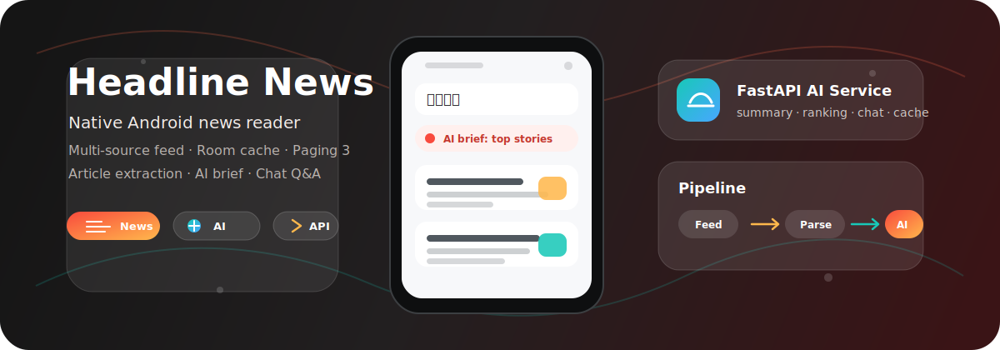
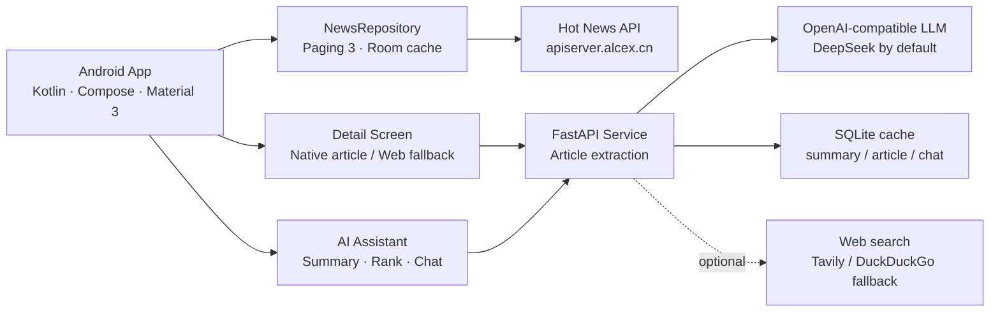

<p align="center">
  
</p>

<h1 align="center">Headline News</h1>

<p align="center">
  一套面向移动端交付的智能资讯应用：Android 原生客户端 + Python AI 服务端。
</p>

<p align="center">
  <a href="https://kotlinlang.org"></a>
  <a href="https://developer.android.com/jetpack/compose"></a>
  <a href="https://fastapi.tiangolo.com"></a>
  <a href="https://www.python.org"></a>
  
  
</p>

---

## 项目亮点

| 能力 | 说明 |
| --- | --- |
| 多源热点聚合 | 接入 `v2ex`、`thepaper`、`zhihu`、`geekpark`、`tieba` 等公开资讯源，并按关注、推荐、热榜、新时代 4 个频道混合展示。 |
| 原生 Android 体验 | Kotlin + Jetpack Compose + Material 3，支持启动预加载、下拉刷新、分页加载、加载更多提示和底部导航。 |
| 本地缓存与分页 | Room + Paging 3 + RemoteMediator，首屏 15 条加载，缓存可重排，弱网下体验更稳。 |
| 原生正文阅读 | 根据新闻 URL 抽取标题、来源、发布时间、正文段落和图片，优先在 App 内排版阅读，失败时回退 WebView。 |
| AI 速读与排序 | 服务端根据当前新闻池生成精选新闻、推荐理由、单篇摘要、要点和标签。 |
| 对话式阅读助手 | 支持围绕当前新闻继续追问，带对话历史、建议问题、参考来源、结果缓存和可选联网搜索。 |

> 不包含 IDE 配置、构建产物、本地日志、真实密钥或本机缓存。

## 架构一览



## 技术栈

| 端 | 技术 |
| --- | --- |
| Android | Kotlin、Jetpack Compose、Material 3、Hilt、Room、Paging 3、Retrofit、OkHttp、Coil、Jsoup、Navigation Compose |
| Server | Python 3.11+、FastAPI、Uvicorn、httpx、Pydantic、BeautifulSoup、LangGraph、SQLite Cache |
| 数据源 | `https://apiserver.alcex.cn/daily-hot/{platform}` |
| AI 接口 | OpenAI-compatible Chat Completions，默认按 DeepSeek 配置 |

## 仓库结构

```text
Headline-News/
├── android/                         # Android 原生客户端
│   ├── app/
│   │   ├── build.gradle.kts
│   │   └── src/main/
│   │       ├── AndroidManifest.xml
│   │       ├── java/com/headline/news/
│   │       │   ├── data/            # API、Room、Repository、Paging、正文解析
│   │       │   ├── di/              # Hilt 依赖注入
│   │       │   ├── ui/              # 首页、详情、AI、启动页、主题
│   │       │   ├── MainActivity.kt
│   │       │   └── HeadlineNewsApp.kt
│   │       └── res/
│   ├── gradle/
│   ├── build.gradle.kts
│   └── settings.gradle.kts
├── server/                          # AI 与文章解析服务
│   ├── app/
│   │   ├── __init__.py
│   │   └── main.py
│   ├── .env.example
│   └── requirements.txt
├── docs/assets/                     # README 展示素材
├── .gitignore
└── README.md
```

## 快速开始

### Android 客户端

客户端默认读取公开资讯源，并通过 `ai.local.properties` 覆盖 AI 服务地址。

```powershell
cd android
.\gradlew.bat assembleDebug
```

如需连接自己的服务端，新建 `android/ai.local.properties`：

```properties
ai.baseUrl=https://your-api-domain.com/
ai.appToken=your-app-token
```

`android/ai.local.properties` 已加入 `.gitignore`，不要提交真实 Token。

### AI 服务端

Windows：

```powershell
cd server
python -m venv .venv
.\.venv\Scripts\Activate.ps1
pip install -r requirements.txt -i https://pypi.tuna.tsinghua.edu.cn/simple
uvicorn app.main:app --host 0.0.0.0 --port 8000
```

Linux：

```bash
cd server
python3 -m venv .venv
source .venv/bin/activate
pip install -r requirements.txt -i https://pypi.tuna.tsinghua.edu.cn/simple
uvicorn app.main:app --host 0.0.0.0 --port 8000
```

健康检查：

```bash
curl http://127.0.0.1:8000/health
```

## 服务端配置

复制配置模板：

```bash
cp .env.example .env
```

核心变量：

| 变量 | 说明 |
| --- | --- |
| `AI_PROVIDER` | 模型提供方标识，默认 `deepseek`。 |
| `AI_BASE_URL` | OpenAI-compatible 接口地址，DeepSeek 默认是 `https://api.deepseek.com`。 |
| `AI_API_KEY` | 服务端模型 Key，只能放在服务端 `.env`。 |
| `AI_MODEL` | 默认 `deepseek-chat`。 |
| `AI_APP_TOKEN` | 可选访问令牌；配置后 Android 请求需要携带 `X-App-Token`。 |
| `AI_CACHE_TTL_SECONDS` | 摘要、正文、对话等结果缓存时间。 |
| `AI_WEB_SEARCH_ENABLED` | 是否开启联网搜索增强。 |
| `TAVILY_API_KEY` | Tavily 搜索 Key；未配置时尝试 DuckDuckGo 兜底。 |

示例：

```env
AI_PROVIDER=deepseek
AI_BASE_URL=https://api.deepseek.com
AI_API_KEY=your-api-key
AI_MODEL=deepseek-chat
AI_TIMEOUT_SECONDS=45
AI_MAX_TOKENS=900
AI_CHAT_MAX_TOKENS=520
AI_THINKING=disabled
AI_CACHE_TTL_SECONDS=86400
AI_WEB_SEARCH_ENABLED=false
AI_SEARCH_MAX_RESULTS=3
AI_ARTICLE_FETCH_TIMEOUT_SECONDS=5
TAVILY_API_KEY=
```

服务端使用 SQLite 文件缓存，默认路径为 `server/data/cache.sqlite3`，该目录不会提交到 Git。

## API 摘要

| 方法 | 路径 | 用途 |
| --- | --- | --- |
| `GET` | `/health` | 服务健康检查，返回 provider 与 model。 |
| `POST` | `/api/article/extract` | 根据新闻 URL 提取标题、来源、正文段落和图片。 |
| `POST` | `/api/ai/summary` | 单篇新闻摘要、要点和标签。 |
| `POST` | `/api/ai/daily-brief` | 从新闻池生成今日 AI 速读。 |
| `POST` | `/api/ai/news-rank` | 按公共影响、新鲜度、信息密度和讨论价值排序新闻。 |
| `POST` | `/api/ai/chat` | 单轮新闻问答。 |
| `POST` | `/api/ai/chat/message` | 多轮新闻对话，支持历史、建议问题、参考来源和缓存。 |

## 关键入口

| 文件 | 说明 |
| --- | --- |
| `android/app/src/main/java/com/headline/news/MainActivity.kt` | App 启动、启动动画、导航容器。 |
| `android/app/src/main/java/com/headline/news/ui/home/HomeScreen.kt` | 首页 Tab、新闻列表、AI 速读卡片。 |
| `android/app/src/main/java/com/headline/news/ui/home/HomeViewModel.kt` | 首页状态管理、预加载、刷新、AI 速读请求。 |
| `android/app/src/main/java/com/headline/news/data/repo/NewsRepository.kt` | 新闻源聚合、本地缓存、分页数据流。 |
| `android/app/src/main/java/com/headline/news/data/paging/NewsRemoteMediator.kt` | Paging 远端加载和 Room 写入。 |
| `android/app/src/main/java/com/headline/news/ui/detail/DetailScreen.kt` | 原生新闻详情、AI 摘要、AI 对话。 |
| `android/app/src/main/java/com/headline/news/data/repo/AiRepository.kt` | 客户端 AI API 封装。 |
| `server/app/main.py` | FastAPI 路由、文章解析、AI 调用、缓存、可选搜索。 |

## 生产交付建议

- 将 Android `AI_BASE_URL` 切换为 HTTPS 域名，不建议长期使用裸 IP + HTTP。
- 使用正式签名文件生成 Release 包。
- 服务端 `.env` 只放在服务器，不要写进 Android 源码或提交到 Git。
- 生产环境建议使用 Nginx/Caddy 反向代理到 HTTPS，并用 systemd、Supervisor 或容器托管 Uvicorn。
- 新闻源来自第三方公开接口，可用性取决于第三方接口稳定性、用户网络和服务端网络出口。
- 原生正文解析依赖目标网页结构，已做通用抽取和失败兜底，但部分站点可能因反爬、登录墙或页面结构变化无法完整解析。
- AI 能力依赖模型供应商，正式上线前建议配置限流、日志、异常告警、监控和备份策略。

## 检查清单

- 配置正式域名和 HTTPS。
- 服务端 `.env` 填入真实 AI Key，并确认 Key 未进入 Git 历史。
- Android `ai.local.properties` 指向正式 API 地址。
- 使用 Release 签名重新打包。
- 在真实手机和不同网络环境下验证首页加载、下拉刷新、加载更多、原生详情、AI 速读和 AI 对话。
- 为生产服务增加访问日志、错误日志、基础监控和备份策略。
